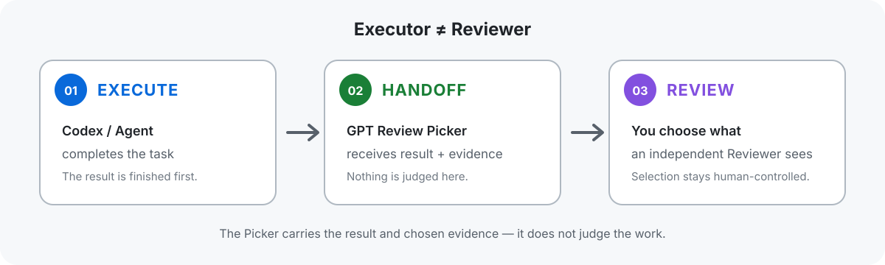
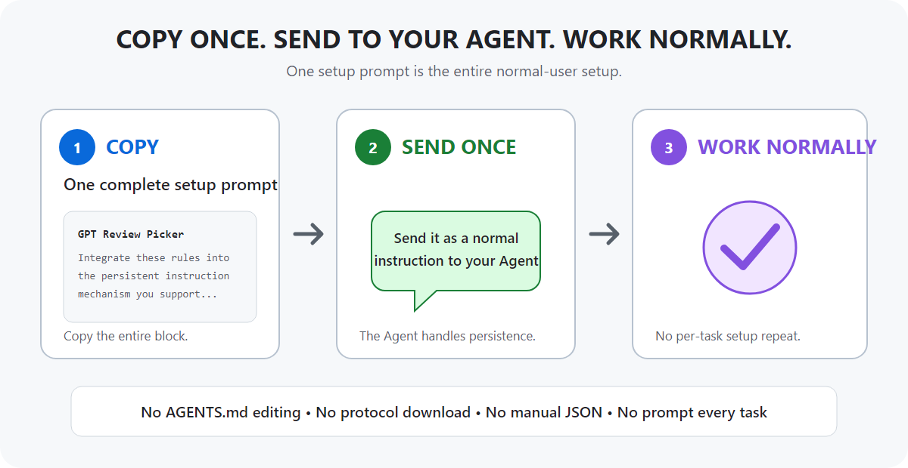
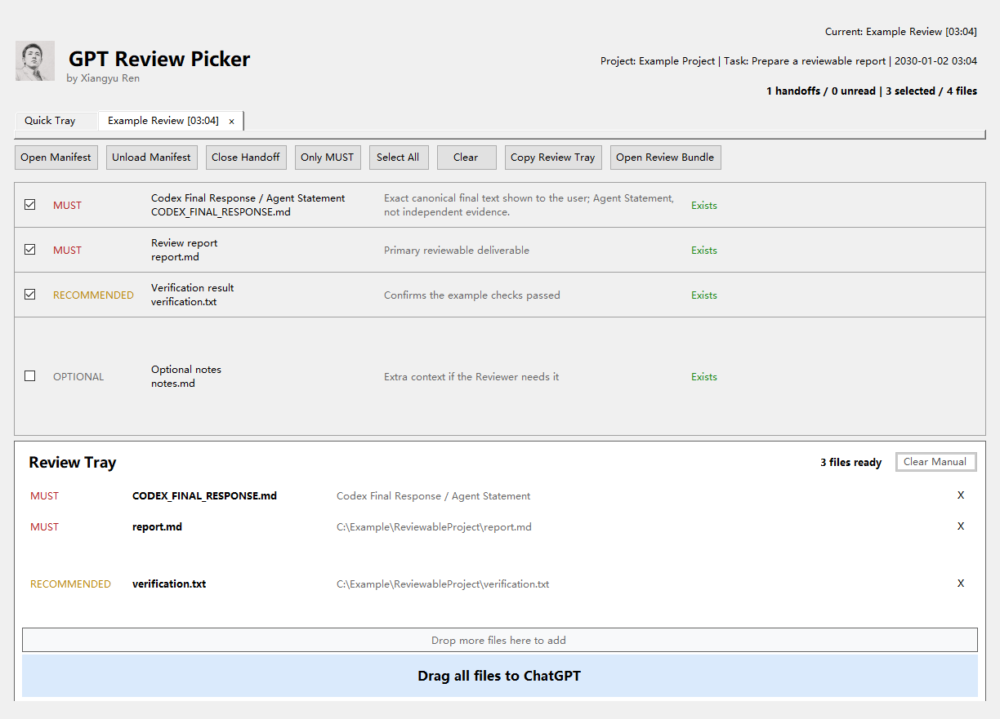

# GPT Review Picker

**Executor ≠ Reviewer.**

GPT Review Picker is a local Windows tool that lets an AI agent hand off completed work to an independent reviewer — with only the evidence that matters.

[**Download for Windows**](https://github.com/renxiangyu1992/GPT-Review-Picker/releases) · [**Set up your Agent**](docs/CODEX_SETUP.md)

> The packaged Windows 10/11 x64 ZIP will appear on GitHub Releases with v0.1.0. Until then, this repository is a private preview. The source archive behind GitHub's green **Code** button is not the Windows app download.



## Why?

AI agents can execute substantial tasks, but asking the same agent to be the only judge of its own work weakens independent review. GPT Review Picker creates a lightweight handoff between the executor and a separate reviewer without treating self-review as inherently invalid.

## Quick start

### 1. Download

Download the packaged Windows x64 ZIP from [GitHub Releases](https://github.com/renxiangyu1992/GPT-Review-Picker/releases), unzip it, and run:

```text
GPTReviewPicker.exe
```

The packaged build is self-contained, so it should not require a separate .NET runtime. The executable is not currently claimed to be code-signed or SmartScreen-free.

### 2. Set up your Agent

Open [Agent Setup](docs/CODEX_SETUP.md), copy the single complete setup prompt, and send it once to the AI Agent you use. The Agent will integrate the rules into the persistent instruction mechanism supported by its environment, or tell you the minimum exact action required.



Copy once. Send to your Agent. Then work normally. Normal users do **not** need to edit `AGENTS.md`, copy or download `PUBLIC_PROTOCOL_V1.md`, or write Producer Request JSON by hand.

### 3. Work normally

Complete tasks as usual. When a substantive result is ready for independent review, the Agent sends its completed statement and a minimal evidence set to Picker.

### 4. Review independently

Choose the Agent Statement and files you want reviewed, then send that selection to ChatGPT or another independent Reviewer. Picker is the handoff tool; it is not the Reviewer.

## See the Picker



The screenshot uses synthetic example data. The user decides which evidence enters the Review Tray before sending it to an independent Reviewer.

## Local and under your control

Picker works with local file paths and does not upload evidence by itself. You remain in control of what is selected and sent. Any downstream review service you choose, including ChatGPT, follows its own data-handling terms after you send the selected material.

## Download versus source code

- **Normal Windows users:** download the packaged Windows ZIP from [GitHub Releases](https://github.com/renxiangyu1992/GPT-Review-Picker/releases).
- **Developers:** clone this repository and use the build instructions below.

Do not use GitHub's repository source ZIP as a substitute for the packaged Windows application.

## Documentation

- [Agent Setup](docs/CODEX_SETUP.md) — the authoritative one-time Agent setup prompt
- [Public Protocol v1.0](docs/PUBLIC_PROTOCOL_V1.md) — authoritative public contract
- [Integration guide](docs/INTEGRATION.md) — operational flow and executable discovery
- [Producer Request schema](docs/PRODUCER_REQUEST_SCHEMA.md)
- [Manifest schema](docs/MANIFEST_SCHEMA.md)
- [Result examples](docs/RESULT_EXAMPLES.md)
- [Architecture](docs/ARCHITECTURE.md)
- [Security and privacy](docs/SECURITY_AND_PRIVACY.md)
- [Synthetic samples](samples/README.md)

## Run

Open the standalone Quick Tray:

```powershell
GPTReviewPicker.exe
```

Open a Manifest directly:

```powershell
GPTReviewPicker.exe "C:\Example\ReviewableProject\manifest.json"
```

Generate and deliver a Handoff from a canonical Producer Request:

```powershell
GPTReviewPicker.exe --handoff-request "C:\Example\ReviewableProject\producer-request.json"
```

The canonical Agent workflow authors Request schema `1.0` using `items` and priorities `MUST`, `RECOMMENDED`, and `OPTIONAL`. A Request with `conversation_id` produces preferred Manifest schema `1.2`. Picker continues to accept Manifest `1.0` and `1.1` for compatibility.

## When to hand off

Hand off only after a substantive reviewable result exists, unless the user explicitly requests or suppresses review. Typical candidates include meaningful code changes, documents, spreadsheets/data work, image/design deliverables, formal reports, releases, and consequential configuration changes.

Do not hand off ordinary questions, casual discussion, status checks, read-only exploration, or trivial actions by default. Public use does not require a `GPT_REVIEW_HANDOFF.md` file. A final-response-only Handoff is valid when the Agent Statement itself is the reviewable result.

## Minimal sufficient evidence

Select the smallest set that lets an independent Reviewer judge the main claim and, when useful, diagnose failure:

- `MUST`: required for reliable core judgment; missing evidence blocks generation.
- `RECOMMENDED`: useful for deeper verification; missing evidence warns.
- `OPTIONAL`: auxiliary context such as broad logs or supplementary screenshots; missing evidence warns.

Do not attach an entire repository, build output, dependency caches, full raw logs, private data, secrets, or redundant paths by default. Priority expresses review importance; the human retains final selection control.

## Workspace behavior

`Quick Tray` is fixed and accepts Manual files without a Manifest. Each Handoff identity has its own selection, Manual files, Review Tray, status, and output state. New background Handoffs are marked unread without interrupting the active Tab.

For Manifest `1.2`, `conversation_id` owns one Tab and `handoff_id` identifies one task review round:

- same conversation plus a new Handoff ID replaces the current round and clears prior Manual files for that round;
- an identical replay reuses the round, reports `replayed: true`, and retains Manual files;
- conflicting reuse of a Handoff ID with changed canonical content is blocked;
- failed replacement preserves the last-known-good round and its Manual files;
- different conversation IDs remain isolated;
- the stable Tab title changes only through explicit `rename_conversation: true`.

Manifest `1.1` uses `handoff_id` as Tab identity. Manifest `1.0` uses the canonical Manifest path.

Closing a Handoff removes only in-memory Workspace state. It never deletes the Request, Manifest, Result, evidence, or source files.

## Agent Statement and receipt

`final_response` is the frozen, user-facing task-result Agent Statement prepared before Producer invocation. Producer hashes and preserves its exact UTF-8 content. Picker exposes it as a virtual, selected `MUST` source named `CODEX_FINAL_RESPONSE.md`; it is materialized only for output and is not independent evidence.

The later transport receipt is separate. A correct report can say:

```text
Task Result: SUCCESS
Review Handoff: FAILED
Reason: Picker unavailable
```

A blocked or failed Handoff never retroactively changes a successfully completed business task.

## Executable discovery

Agent integrations use a bounded lookup:

1. Valid `GPT_REVIEW_PICKER_EXE`.
2. `%LOCALAPPDATA%\GPTReviewPicker\GPTReviewPicker.exe`.
3. One exact lookup for an already-running `GPTReviewPicker` process and its valid executable path.
4. An explicit user-provided portable path.
5. Otherwise report Picker unavailable and stop.

Do not recursively scan drives or personal directories and do not guess an extraction, username, developer, or `C:\GPTReviewPicker` path. An arbitrary portable ZIP location cannot be inferred while Picker is not running.

The optional local integration helper installs a formal publish at the stable per-user path:

```powershell
.\Tools\Install-LocalIntegration.ps1 -SetUserEnvironmentVariable
```

Installation and release packaging are distribution operations, not protocol requirements.

## Local files and outputs

Producer validates local paths, collapses duplicates, references evidence in place, and never uploads it. Picker accepts ordinary local file types. Missing Manifest items remain visible but are excluded from Clipboard, drag, and Bundle output.

Every output action applies only to the active Tab:

- `Copy Review Tray` writes a Windows multi-file Clipboard FileDrop.
- Dragging one row sends one local file.
- `Drag all files to ChatGPT` sends the active tray in one FileDrop operation.
- `Open Review Bundle` copies selected sources into an isolated local bundle without modifying originals.

Folders are ignored without recursion. When the same path is selected from a Manifest and added manually, the Manifest source wins.

## Persistence and Result

Conversation-aware metadata uses a bounded slot:

```text
<project_root>\.gpt-review\conversations\<conversation_id>\
  request.json
  manifest.json
  result.json
```

Same-conversation generation/delivery is serialized. Individual files are atomically replaced where implemented; the three files are not one filesystem transaction. After normal Producer CLI completion, the terminal snapshot is coherent, and failed replacement preserves the last-known-good valid round.

Terminal Result statuses are `delivered` (exit `0`), `blocked` (exit `2`), and `manifest_created_delivery_failed` (exit `3`). Exit `4` is unexpected Producer failure. The internal `manifest_created` transition is not a terminal public outcome.

## Build and test

The project targets .NET 8 WinForms. Build and run the regression suite with:

```powershell
dotnet run --project .\Tests\GPTReviewPicker.Tests.csproj -c Debug
dotnet run --project .\Tests\GPTReviewPicker.Tests.csproj -c Release
```

Publish a self-contained single-file Windows x64 executable with:

```powershell
dotnet publish .\GPTReviewPicker.csproj -c Release -r win-x64 --self-contained true -p:PublishSingleFile=true -p:IncludeNativeLibrariesForSelfExtract=true
```

## Limits

There is no directory recursion, content preview, AI/API upload, folder watcher, conversation watcher, Codex UI/database reader, history database, cloud sync, Git integration, full installer, or auto-update. Only one Picker window runs for the current Windows user, and local IPC is restricted to that user by the implementation.
